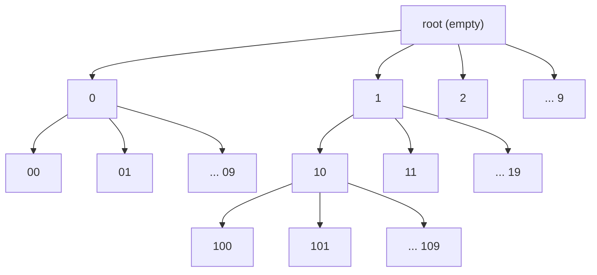
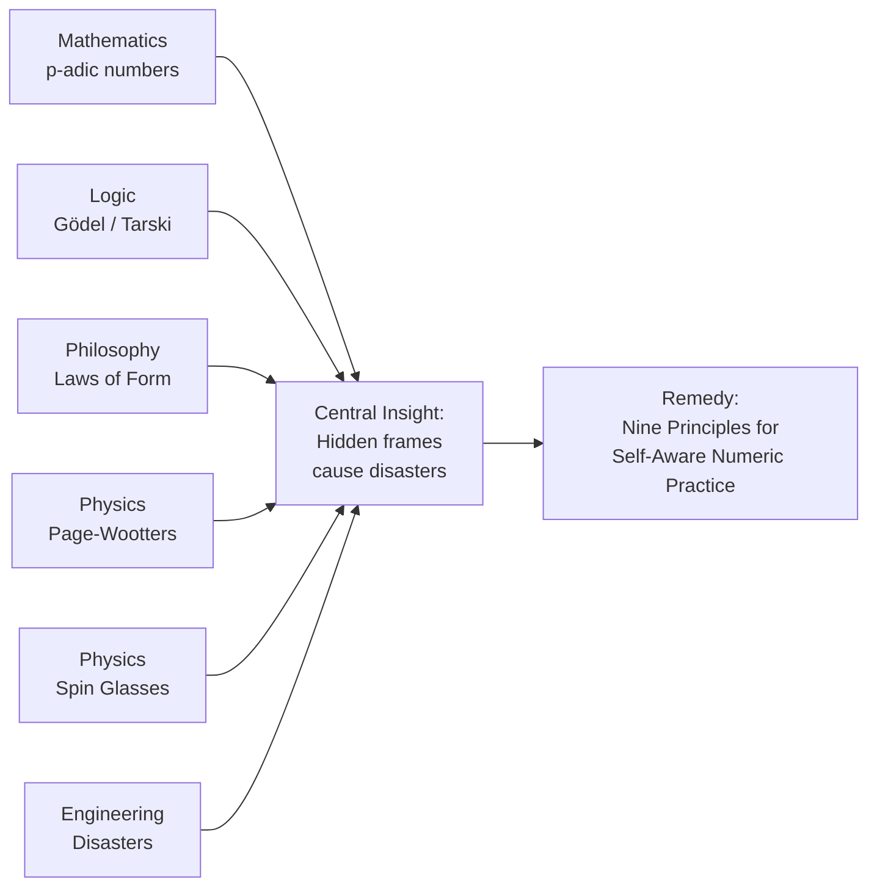

# NUMBERS ARE TREES, NOT LINES

## The Hidden Geometry That Crashed a Spaceship, Broke Your Compiler, and Might Explain the Universe

---

> *"There are 10 types of people in the world: those who understand binary, and those who don't."*
>
> This is the best joke in computer science. It is also, this guide will argue, the most important.

---

**A Layperson's Guide to the Silent Radix Research Program**

**Author:** QNFO Research / QWAV  |  **Date:** 2026-07-02

Based on: *The Silent Radix: Positional Notation as Ultrametric Tree and the Calculus of Indications as Remedy*  
QNFO Research, 2026 · DOI: [10.5281/zenodo.21134188](https://doi.org/10.5281/zenodo.21134188)

---

## Table of Contents

1. [The Joke That Isn't Funny](#part-1--the-joke-that-isnt-funny)
2. [The Number Tree](#part-2--the-number-tree)
3. [The Wreckage: When Hidden Frames Cause Disaster](#part-3--the-wreckage)
4. [The Lost Mathematics: p-adic Numbers](#part-4--the-lost-mathematics)
5. [The Philosophical Foundation: Laws of Form](#part-5--the-philosophical-foundation)
6. [The Physics: Quantum Clocks and Frozen Disorder](#part-6--the-physics)
7. [Nine Principles for Self-Aware Numbers](#part-7--nine-principles)
8. [What This Means for You](#part-8--what-this-means-for-you)
9. [What We Know and What We Don't](#part-9--what-we-know-and-what-we-dont)
10. [FAQ](#part-10--faq)
11. [Glossary](#part-11--glossary)
12. [Further Reading](#part-12--further-reading)
13. [The Invitation](#part-13--the-invitation)

---

## Part 1 · The Joke That Isn't Funny

### 1.1 The Setup

Every programmer knows this joke:

> *"There are 10 types of people in the world: those who understand binary, and those who don't."*

The punchline, of course, is that "10" in binary (base-2) means *two*, not *ten*. If you get the joke, you're in the first group. If you don't, you're in the second.

It's a simple pun. A nerdy icebreaker. Harmless fun.

**Except it isn't.**

### 1.2 The Punchline You Missed

Here's what the joke is actually saying:

> *The same symbol — "10" — means two completely different things, and the difference is invisible on the page. You can only tell what it means if you already know the context. And if you guess wrong, you are catastrophically wrong.*

That's not a joke. That's a **structural defect** in how we write numbers.

And this defect has consequences. Real, physical, expensive, deadly consequences.

### 1.3 The Thesis of This Guide

This guide presents a research program that makes a radical claim:

> **Numbers are not points on a line. They are leaves on a tree. We have been drawing them wrong for 400 years, and this mistake has caused disasters across every field that uses numbers — from spaceflight to psychology to the foundations of physics itself.**

The claim is audacious. But the evidence spans mathematics, engineering disasters, quantum physics, and the deepest questions about what it means to measure anything at all.

By the end of this guide, you will never look at the number "10" the same way again.

---

## Part 2 · The Number Tree

### 2.1 What You Were Taught

From kindergarten onward, we're taught that numbers live on a *number line*:

```
··· -3 ---- -2 ---- -1 ---- 0 ---- 1 ---- 2 ---- 3 ···
```

Numbers are equally spaced. Distance means the difference between them. 7 is closer to 8 than to 12 because |8 − 7| = 1 and |12 − 7| = 5. This is the **Euclidean metric**, and it feels so natural that most people assume it's the *only* way numbers can be arranged.

### 2.2 What You Weren't Taught

But here's the thing: the number line is a *choice*, not a fact.

Consider how you actually write numbers. When you write "327", what are you doing? You're using **positional notation**: each position represents a power of the base:

$$327 = (3 \times 10^2) + (2 \times 10^1) + (7 \times 10^0)$$

The rightmost digit is the ones place. The next digit left is the tens place. The next is the hundreds place. Each position is a *level*, and each level can hold digits 0 through 9.

Now visualize this. Instead of a line, it's a **tree**:



Every number is a path from the root down through the levels. The rightmost digit is the *first branch* (ones place). The next digit is the *second branch* (tens place). And so on.

This is called an **ultrametric tree**. "Ultrametric" is a fancy word, but the idea is simple: **two numbers are "close" if they share the same trailing digits.**

### 2.3 Tree Distance vs. Line Distance

Let's compare two ways of measuring "closeness":

| Pair | Line Distance | Tree Distance (nesting) |
|------|--------------|------------------------|
| 327 and 327 | 0 (identical) | 0 (identical) |
| 327 and 326 | 1 (one apart) | 0 levels shared (they differ at ones place) |
| 327 and 320 | 7 | 1 level shared (tens place: "2") |
| 327 and 300 | 27 | 2 levels shared (hundreds place) |
| 327 and 100 | 227 | 0 levels shared |

On the **line**, 327 is much closer to 326 (distance 1) than to 320 (distance 7).

On the **tree**, 327 and 320 share a parent ("32..."), making them *closer* than 327 and 326, which diverge immediately at the ones place.

**These are two completely different geometries.** And positional notation — the way we actually write numbers — is inherently the tree geometry, not the line geometry.

### 2.4 The Strong Triangle Inequality

In ordinary line-based distance, the triangle inequality says:

$$d(A, C) \leq d(A, B) + d(B, C)$$

In plain English: the direct path from A to C can't be longer than going through B.

In tree-based (ultrametric) distance, we get something stronger:

$$d(A, C) \leq \max(d(A, B), d(B, C))$$

This is the **strong triangle inequality**, and it means: *any three points form an isosceles triangle with the two equal sides at least as long as the third.* In a tree, you can't have three points where all three distances are different. One pair is always the "outsider."

This isn't just mathematical trivia. It has physical consequences, as we'll see in Part 6.

---

## Part 3 · The Wreckage

### 3.1 The Silent Radix

**Radix** is the formal word for "base." Decimal is base-10. Binary is base-2. Octal is base-8.

The problem: **The radix isn't written on the number.**

When you see the numeral "10", is it:

- Ten (decimal)?  
- Two (binary)?  
- Eight (octal)?  
- Sixteen (hexadecimal)?  
- Sixty (Babylonian sexagesimal)?

**You cannot tell from the symbol alone.** The base is *silent*. It's supplied by context, convention, or guesswork — any of which can be wrong.

This is the **Silent Radix Problem**. And it has a body count.

### 3.2 Disaster #1: The Mars Climate Orbiter (1999)

**What happened:** NASA's $327.6 million Mars Climate Orbiter approached Mars for orbital insertion. It was supposed to settle into orbit at 140–150 km above the surface. Instead, it entered at 57 km — deep inside the atmosphere — and was destroyed.

**Why:** The navigation team at Lockheed Martin calculated thruster impulses in **pound-force seconds** (English units). The flight software at NASA's Jet Propulsion Laboratory expected those numbers in **newton-seconds** (metric units). The numbers were transmitted correctly. But the *units* — the interpretive frame — were wrong.

**Cost:** $327.6 million. One spacecraft. Years of science lost.

**The pattern:** The unit wasn't carried with the number. The frame was silent.

### 3.3 Disaster #2: The Gimli Glider (1983)

**What happened:** Air Canada Flight 143, a Boeing 767 with 69 people aboard, ran out of fuel at 41,000 feet over Manitoba. Both engines flamed out. The pilots glided the aircraft to an emergency landing on a decommissioned air force base that had been converted to a drag racing strip. Miraculously, no one died.

**Why:** Canada had recently switched from imperial to metric units. The ground crew calculated the fuel load in **pounds** instead of **kilograms**. The aircraft had half the fuel everyone thought it did.

**The pattern:** Same as the Mars orbiter. The frame (unit) was missing.

### 3.4 Disaster #3: The C Octal Bug

**What happened:** In the C programming language (and its descendants C++, Java, JavaScript, and many others), a number starting with `0` is interpreted as **octal** (base-8), not decimal. So `010` equals 8, not 10.

This has caused hundreds of documented software vulnerabilities. Security researchers have repeatedly found bugs where programmers wrote something like:

```c
int permissions = 010;  // Programmer meant "10", compiler reads "8"
```

When the program checks permissions, it uses 8 instead of 10 — potentially granting access that should have been denied.

**The pattern:** The base was silently assumed. The leading zero — a formatting choice — silently changed the meaning.

### 3.5 Disaster #4: Likert Scale Abuse

**What happened:** Every day, thousands of researchers ask participants to rate things on scales like 1–5 or 1–10 ("Rate your pain from 0–10"). Then they compute the **average** and run statistical tests that assume equal spacing between the numbers.

**The problem:** A pain rating of 7 is not "1.4 times worse" than a rating of 5. The numbers are **ordinal** (ranked) but not **interval** (equally spaced). Treating them as equally spaced produces nonsense.

In 1946, the psychologist S.S. Stevens classified measurement into four types:
- **Nominal:** Just labels (e.g., jersey numbers)
- **Ordinal:** Ranked but not equally spaced (e.g., pain scales, movie rankings)
- **Interval:** Equally spaced but no true zero (e.g., temperature in Celsius)
- **Ratio:** Equally spaced with a true zero (e.g., length, mass)

Computing an average on ordinal data is a **category error** — it's like asking what color the number 7 smells like.

**The pattern:** The scale type was silently assumed.

### 3.6 The Common Thread: Silent Frame Failure

Every one of these disasters follows the exact same four-step pattern:

```
┌─────────────────────────────────────────────────────┐
│                                                     │
│  1. A NUMBER IS CREATED in one context              │
│     with a specific FRAME                           │
│     (base, unit, scale type, metric)                │
│                                                     │
│  2. The FRAME is NOT CARRIED with the number        │
│                                                     │
│  3. The NUMBER ENTERS a new context                 │
│     where the DEFAULT FRAME is different            │
│                                                     │
│  4. DISASTER                                        │
│     The mismatch produces an error                  │
│                                                     │
└─────────────────────────────────────────────────────┘
```

This pattern is **invariant across domains**:

| Domain | Example | Missing Frame |
|--------|---------|---------------|
| Aerospace | Mars Climate Orbiter | Units (lbf·s vs N·s) |
| Aviation | Gimli Glider | Units (lbs vs kg) |
| Software | C octal bug | Base (octal vs decimal) |
| Psychology | Likert averages | Scale type (ordinal vs interval) |
| Ancient math | Babylonian tablets | Base (sexagesimal vs decimal) |

**The frame is always missing. The disaster is always the same.**

### 3.7 It Gets Worse: The Frame is Structural

Here's the disturbing part: these aren't "mistakes" in the sense of carelessness. They are **structural features** of positional notation.

When you write "10", you have *written down the digits but not the base.* The base is **not part of the notation**. It lives in your head, in the documentation, in the context — anywhere but on the number itself.

This means: **positional notation is incomplete.** It requires an external frame to have meaning. And when that external frame is wrong, lost, or mismatched, the notation silently produces the wrong number.

This is, as we'll see, a miniature version of **Gödel's Incompleteness Theorem** — a system that cannot fully specify its own interpretation from within.

---

## Part 4 · The Lost Mathematics

### 4.1 Kurt Hensel's Discovery (1897)

In 1897, the German mathematician Kurt Hensel made a strange discovery. He asked: what if we measure distance the *tree way* instead of the *line way*?

Instead of |b − a|, use the **shared trailing digits**. More formally, for a prime number *p*, define:

$$|x|_p = p^{-k}$$

where *k* is the number of times *p* divides *x*. In base *p*, this is exactly the nesting depth in the tree.

Two numbers are *p*-adically close if their difference is divisible by a high power of *p* — which is the same as saying they share many trailing digits in base *p*.

These are the **p-adic numbers**. They form a complete number system, just like the real numbers — but with a tree geometry instead of a line geometry.

### 4.2 Ostrowski's Bombshell (1916)

In 1916, Alexander Ostrowski proved something that should have shaken mathematics to its core. His theorem states:

> **There are exactly two fundamentally different ways to complete the rational numbers into a number system where every "convergent" sequence has a limit:**
>
> 1. **The real numbers** (line geometry, Euclidean distance) — the one everyone knows
> 2. **The p-adic numbers** (tree geometry, ultrametric distance) — the one almost nobody knows

**That's it.** There are only two. The line and the tree.

This means the number line isn't the "natural" or "only" way to arrange numbers. It's one of exactly two mathematically valid choices. The tree was always there, equally fundamental. We just forgot about it.

### 4.3 Why p-adic Numbers Were Forgotten

If p-adic numbers are so fundamental, why don't we learn about them in school?

Three reasons:

1. **They're counterintuitive.** In the p-adic world, 1 + 2 + 4 + 8 + 16 + ... actually converges to −1 (in the 2-adic numbers). This makes your brain hurt.

2. **They seem abstract.** For most of the 20th century, p-adic numbers were a niche tool in number theory — useful for proving theorems about Diophantine equations, but seemingly disconnected from everyday experience.

3. **The line won the cultural war.** Descartes drew numbers on a line in the 17th century, and that image has dominated Western thought ever since. The tree was never drawn.

But here's the twist: **we use tree geometry every single day** in positional notation. We just don't *know* we're using it.

### 4.4 The Re-discovery

The central insight of the Silent Radix research program is:

> **Positional notation is not a line-like system that happens to use digits. It is a tree-like system that we have mistakenly flattened onto a line.**

When you write "327", you are constructing a path down an ultrametric tree. The fact that we *also* map this onto a number line for convenience doesn't change the underlying geometry.

This means the disasters we saw in Part 3 aren't isolated engineering failures. They are **symptoms of a geometric mismatch** between the tree structure of our notation and the line structure of our thinking.

---

## Part 5 · The Philosophical Foundation

### 5.1 Spencer-Brown and the Calculus of Indications

In 1969, the British mathematician and philosopher George Spencer-Brown published a strange, slim book called *Laws of Form*. It begins with a single, radical proposition:

> **The most basic act is drawing a distinction.**

Not a point. Not a set. Not a number. Not a thing. The *act* itself — marking a boundary that separates "this" from "that" — is the primitive operation from which everything else is built.

Spencer-Brown developed a "calculus of indications" — an algebra of distinctions — that showed how arithmetic and logic both emerge from the repeated act of drawing distinctions.

### 5.2 From Distinctions to Numbers

In Spencer-Brown's framework:

- **The unmarked state** (before any distinction is drawn) = **zero**
- **Drawing one distinction** = **one**
- **Drawing two distinctions** = **two**
- And so on...

But then something remarkable happens. When you've drawn enough distinctions to fill one "level" of grouping, you *carry* to the next level and start over. The act of carrying **is** the radix.

In decimal (base-10), you draw up to 9 distinctions, and the 10th distinction triggers a carry:
- 0, 1, 2, ..., 9 → one more creates "10"

The numeral "10" is not "ten things." It is:

> **"One cycle completed at the next level, zero cycles at this level."**

The "1" in "10" is *not* the same thing as the standalone "1". It's a **re-entry** — the distinction that observes its own completion and starts a new level.

### 5.3 The Minimal Observer

This re-entry is profound. Think about what's happening:

- The system is counting
- The system reaches its limit (9 in decimal)
- The system **observes** that it has reached its limit
- The system records this observation as a "1" at the next level
- The system resets the current level to "0"

This is **self-reference** built into the very act of counting. The numeral "10" is the moment when a counting system becomes aware of its own limitation and transcends it by starting a new level.

Spencer-Brown called this "re-entry" — the form re-entering its own indicational space. The research program argues that **"10" is the minimal observer** — the seed of self-awareness embedded in every act of quantitative measurement.

### 5.4 The Observer Erased

Now we can see the full tragedy of the number line.

When we flatten the tree onto a line, we erase:
- The **levels** (tree branches become indistinguishable points)
- The **radix** (the grouping rhythm that defines each level)
- The **observer** (the re-entry that completes one level and starts the next)

What's left is a bare, context-free "10" — a ghost of a number, stripped of its history and its meaning.

**To silence the radix is to erase the observer.** The number line is a map that has forgotten it's a map.

### 5.5 Gödel and Tarski: The Logic of Incompleteness

This connects to two of the deepest results in 20th-century logic:

- **Gödel's Incompleteness Theorem (1931):** Any sufficiently powerful formal system cannot prove its own consistency from within. There will always be true statements that the system cannot prove using only the system's own rules.

- **Tarski's Undefinability Theorem (1933):** A formal system cannot define truth for its own statements within itself. Truth requires a meta-language — a frame outside the system.

The silent radix is a miniature Gödel sentence. The numeral "10" cannot tell you what it means. It needs an external frame — the radix — which is not part of the notation itself. **Positional notation is incomplete in exactly Gödel's sense.**

---

## Part 6 · The Physics

### 6.1 The Problem of Time in Quantum Gravity

In quantum mechanics, time is special. In the Schrödinger equation, time is an external parameter — a clock that ticks outside the system. But in general relativity, time is part of the system — it bends with space, slows near mass, and had a beginning at the Big Bang.

When you try to combine quantum mechanics and general relativity into a theory of **quantum gravity**, you hit a wall: **there is no external clock.** The universe doesn't have a cosmic stopwatch sitting outside it. So what does "time" even mean?

This is the **problem of time** in quantum gravity.

### 6.2 The Page-Wootters Solution (1983)

In 1983, Don Page and William Wootters proposed an elegant solution: **use part of the system as the clock.**

Imagine the universe is a static quantum state — nothing moves, nothing changes. But if you pick one part of the system and designate it as "the clock," then the *rest* of the system appears to evolve in time relative to the clock's readings. Time emerges from a timeless state through the act of measurement.

This is called the **Page-Wootters mechanism**, and it's been experimentally verified with photons and proposed for trapped-ion quantum computers.

### 6.3 The Crucial Question: Line or Tree?

When you use the Page-Wootters mechanism, the clock and the rest of the system interact. The question is: **what kind of geometry does the resulting "history" have?**

- If the clock and rest interact **nondiagonally** (they exchange energy), do the resulting states form a line or a tree?
- If they interact **diagonally** (no energy exchange — an ideal clock), what then?

The Silent Radix research team ran **over 8,000 computer simulations** of Page-Wootters clocks with random interactions to answer this question.

### 6.4 The Results

| Clock-Rest Interaction | Ultrametricity Violation Rate | Geometry |
|------------------------|-------------------------------|----------|
| **Random coupling** (general interaction) | ~33% | Mixed — sometimes tree, sometimes not |
| **Diagonal coupling** (no energy exchange) | **0%** | **Perfect tree** |

The diagonal case — the "classical ideal clock" — produces a **perfectly ultrametric** history. Every state is arranged in a tree, with no violations.

### 6.5 The Interpretation

This result is profound. It means:

1. **Ultrametricity (tree structure) is the natural geometry of time** when the clock doesn't disturb the system it's measuring.

2. **The number line is a special case** that emerges only when the clock and system interact strongly enough to blur the tree structure.

3. **Time is fundamentally branching**, not flowing. The "flow" we perceive is a secondary effect that emerges when we coarse-grain the tree.

This is a direct physical realization of the Silent Radix thesis: **the tree comes first, the line comes second.**

### 6.6 Spin Glasses: When Disorder Freezes

There's a second physical system where the tree structure appears: **spin glasses.**

A spin glass is a magnetic material where the atomic magnets (spins) are randomly arranged, so they can't all align the way they do in a regular magnet. Instead, they get "frustrated" — each spin is pulled in conflicting directions by its neighbors.

The mathematical model of spin glasses (the **Sherrington-Kirkpatrick model**, solved by Giorgio Parisi, who won the 2021 Nobel Prize for this work) exhibits a phenomenon called **replica symmetry breaking**. At low temperatures, the system breaks into many distinct configurations, and the "distance" between these configurations has a tree-like (ultrametric) structure.

### 6.7 The Suppression Effect

The Silent Radix researchers asked: what happens if you *enforce* ultrametricity on the spin glass? Does the tree structure change the behavior?

The answer: **yes, dramatically.**

The phase transition where the spin glass "freezes" (replica symmetry breaking) is **suppressed by 10–15 times** when the ultrametric constraint is applied. The tree structure acts like a backbone that prevents the system from becoming glassy and disordered.

This means **the tree is a physical organizing principle**, not just a mathematical curiosity. It has measurable, suppressible effects on real physical systems.

---

## Part 7 · Nine Principles

### 7.1 From Diagnosis to Remedy

We've diagnosed the problem: **hidden interpretive frames cause systematic disasters.** The solution is not "be more careful." The solution is to change the foundation — to make every number carry its own interpretive frame explicitly.

The research program distills this into **Nine Principles for Self-Aware Numeric Practice:**

### 7.2 The Principles

#### 1. Cyclic Grounding
Every numeral declares the cycles it counts. A "cycle" is a complete traversal of one level of the tree — 0 through 9 in decimal, 0 through 1 in binary. Numbers are not inert labels; they are records of completed groupings.

#### 2. Explicit Frame
No number travels without its radix, metric, unit, and scale type. These are not optional metadata — they are **part of the number's identity**. A naked "10" is incomplete.

#### 3. Native Ultrametric
The default notion of distance is tree-based: shared nesting depth, not linear difference. If you need the line, state it explicitly.

#### 4. Zero as Root
The unmarked state (zero) is the origin of the tree, not a point on a line. There is no "negative distance" in the tree — you don't go "below" the root.

#### 5. Re-entry as Self-Measurement
"10" is the cycle observing its own completion. Self-reference is not a bug; it is the mechanism by which systems transcend their own limits.

#### 6. Arithmetic Invariance
The laws of arithmetic (addition, multiplication) hold across frames. Their *meaning* is frame-dependent. 2 + 2 = 4 is true in binary and decimal, but the *size* of "4" relative to "10" changes with the base.

#### 7. Layered Completion
The continuous line (real numbers) is a secondary construction built from the discrete tree. The tree is fundamental; the line is derived.

#### 8. Second-Order Numeracy
Systems that use numbers must represent their own representational choices. A compiler should know (and tell you) what base a numeric literal uses. A spreadsheet should know (and tell you) what scale type a column contains.

#### 9. Temporal Primacy
Time (cyclic counting) is fundamental; space (the line) is derived. The tree branches, and the line emerges as a shadow.

### 7.3 The Principles in Practice

Here's what these principles look like concretely:

| Without the Principles | With the Principles |
|------------------------|---------------------|
| `x = 10` | `x = 10₁₀` (decimal) or `x = 10₂` (binary) — the radix is explicit |
| `mass = 150` | `mass = 150 kg` — the unit is attached |
| Average of [1,2,3,4,5] | "These are ordinal rankings; median is 3, not 2.5" — the scale type is declared |
| Distance between numbers | Tree distance (shared digits) is the default; Euclidean distance is explicit |

---

## Part 8 · What This Means for You

### 8.1 If You're a Programmer

The C octal bug has been biting programmers for 50 years. The fix isn't just "be more careful" — it's to **make the base explicit in the language itself**.

Languages like Python (3.x) and Rust have started doing this: `0o10` is octal, `0b10` is binary, `0x10` is hex, and plain `10` is decimal. The prefix **carries the radix**. This is Principle #2 in action.

But we can go further:
- Type systems could encode unit information (e.g., `let fuel: Mass<Kilograms> = 150`)
- Linters could flag mixed-scale comparisons
- Documentation generators could require unit declarations

### 8.2 If You're a Scientist or Engineer

The Mars Climate Orbiter didn't crash because someone was lazy. It crashed because the **system allowed units to be implicit**.

Practical steps:
- Use unit-aware libraries (Python's `pint`, Julia's `Unitful`)
- In spreadsheets, label every column with its unit — and treat unlabeled numbers as errors
- When combining datasets, verify unit consistency *programmatically*, not manually
- Report scale types explicitly in methods sections ("We measured X on a 7-point ordinal Likert scale...")

### 8.3 If You're in Psychology or Social Sciences

The Likert scale problem is endemic. Entire fields produce results that may be statistically invalid because they treat ordinal data as interval data.

Practical steps:
- Use nonparametric statistics (median, not mean; Spearman, not Pearson) for ordinal data
- State the scale type explicitly: "a 5-point Likert scale (ordinal)"
- Consider whether your scale actually has equal intervals (most don't)
- If you must use parametric tests, justify and caveat heavily

### 8.4 If You're an Educator

Every student learns the number line. Almost no student learns the number tree. This is a curriculum failure of 400 years' standing.

What to do:
- Teach positional notation as a **tree** before teaching the number line
- Show students that "10" means different things in different bases — and make this explicit
- Use tree diagrams to explain carrying, borrowing, and place value
- Teach multiple bases early, not as an advanced topic but as a fundamental insight

### 8.5 If You're Just a Person Who Uses Numbers

You use numbers every day — prices, scores, ratings, measurements. The silent radix affects you too.

- When you see a rating out of 10, ask: is this equally spaced or just ranked?
- When you see a statistic without units, be suspicious
- When someone averages ordinal rankings, ask whether that's valid
- When you compare numbers from different sources, check whether they use the same frame

**The habit to cultivate: every time you see a number, ask "what's the frame?"**

---

## Part 9 · What We Know and What We Don't

Scientific honesty requires distinguishing what's proven, what's supported by evidence, and what's conjecture. Here's a candid assessment.

### 9.1 What's Established (Proven or Strongly Supported)

| Claim | Status | Evidence |
|-------|--------|----------|
| Positional notation forms an ultrametric tree | **Proven** | Mathematical definition — follows directly from place-value structure |
| Ostrowski's Theorem: only real and p-adic completions | **Proven** | Ostrowski (1916), standard number theory |
| Mars Climate Orbiter, Gimli Glider, C octal bug were unit/base errors | **Historical fact** | Official investigation reports |
| Likert scale averages can be statistically invalid | **Well-established** | Stevens (1946), extensive methodology literature |
| Page-Wootters mechanism works (time from static state) | **Verified experimentally** | Multiple photonic experiments |
| Spin glass RSB produces ultrametricity | **Proven** | Parisi (1979), Nobel Prize 2021 |

### 9.2 What's Supported by Simulations (Not Yet Proven or Experimentally Verified)

| Claim | Status | Evidence |
|-------|--------|----------|
| Diagonal Page-Wootters coupling produces perfect ultrametricity | **Simulation-supported** | 8,000+ numerical experiments; formal proof in progress |
| Nondiagonal coupling violates ultrametricity at ~33% rate | **Simulation-supported** | Same numerical experiments |
| Ultrametric constraint suppresses spin glass RSB 10–15× | **Simulation-supported** | k-step RSB analysis with Parisi PDE solver |

### 9.3 What's Conjecture (Theoretical, Not Yet Verified)

| Claim | Status | Notes |
|-------|--------|-------|
| "10" as minimal observer (Laws of Form re-entry) | **Philosophical claim** | Coherent with Spencer-Brown framework; not empirically testable in the usual sense |
| Silent radix as miniature Gödel sentence | **Analogical claim** | Structural parallel to incompleteness; not a formal proof |
| Log-periodic oscillations in CMB | **Prediction** | Methodology established; requires Planck data analysis |
| Educational intervention reduces Likert abuse | **Hypothesis** | Testable; no study yet conducted |

### 9.4 The Boundary

The hardest thing about this research program is knowing where to draw the line between:

- **Mathematics** (what follows from definitions)
- **Physics** (what's empirically testable)
- **Philosophy** (what's coherent but not empirically falsifiable)
- **Metaphor** (structural parallels that are illuminating but not literally true)

The researchers are careful to mark these boundaries. The reader should be too.

---

## Part 10 · FAQ

### Q: Is this saying that numbers are *literally* trees and not lines?

**A:** It's saying that **positional notation** — the way we write numbers like "327" — has the structure of a tree, not a line. The real numbers (the continuous line) are a valid mathematical construction, but they are *derived* from the tree structure, not fundamental to it. So: the tree is the native geometry of written numbers. The line is a useful abstraction built on top.

### Q: Does this mean math is wrong?

**A:** No. The mathematics is correct. What's "wrong" is the *interpretation* — the assumption that the number line is the only valid geometry. Ostrowski proved in 1916 that the tree geometry is equally fundamental. The error is cultural, not mathematical.

### Q: Is the "silent radix" just another way of saying "always label your units"?

**A:** Yes — but it goes deeper. The radix is a *unit of grouping*, not just a unit of measurement. The decimal radix (10) defines how many ones make a ten, just as the kilogram defines how much mass is "one kilogram." The insight is that these are the same logical structure.

### Q: Has this research been published?

**A:** The synthesis paper v1.1 is published on Zenodo (DOI: 10.5281/zenodo.21134188). It is a draft synthesis paper targeting journals in philosophical logic, philosophy of science, or physical review. Individual components (Page-Wootters simulations, Parisi PDE solver) are computational results that can be reproduced.

### Q: Is there an experiment planned?

**A:** Yes. The researchers propose a trapped-ion experiment using Ytterbium ions to test whether diagonal vs. nondiagonal coupling produces ultrametric vs. non-ultrametric histories. The experiment is feasible with current technology (~8 weeks on existing apparatus) and would be a direct test of the Sufficient Condition Theorem.

### Q: Who is this for?

**A:** This research sits at the intersection of mathematics (number theory), physics (quantum foundations, spin glasses), computer science (programming language design), philosophy (foundations of measurement), and education (numeracy curriculum). If any of those interest you, there's something here for you.

### Q: What would change if this research is accepted?

**A:** At minimum: programming languages would require explicit radix prefixes. Unit systems would be mandatory in engineering calculations. Statistics education would teach scale types before parametric tests. And we might get a new generation of students who understand that "10" is not one thing but many things, depending on the frame.

---

## Part 11 · Glossary

| Term | Plain-English Definition |
|------|--------------------------|
| **Radix** | The base of a number system (e.g., 10 for decimal, 2 for binary). The grouping rhythm that determines when you "carry." |
| **Ultrametric** | A tree-like distance where closeness means "shares the same branch." The strong triangle inequality holds. |
| **p-adic numbers** | A number system where distance is measured by shared trailing digits in base *p*. One of only two fundamental ways to complete the rational numbers. |
| **Ostrowski's Theorem** | The proof (1916) that the only two ways to measure distance on rational numbers are Euclidean (the line) and p-adic (the tree). |
| **Positional notation** | The way we write numbers: each position represents a power of the base (e.g., 327 = 3×10² + 2×10¹ + 7×10⁰). Inherently a tree structure. |
| **Silent radix** | The fact that the base is not written on the number itself. "10" could be two, ten, eight, or sixty — you can't tell from the notation alone. |
| **Laws of Form** | George Spencer-Brown's 1969 calculus of indications, building all of logic and arithmetic from the single act of drawing a distinction. |
| **Re-entry** | A distinction that refers to itself — the form entering its own space. "10" is a re-entry: the cycle observing its completion. |
| **Page-Wootters mechanism** | Using part of a quantum system as a clock so that time emerges from a static state. |
| **Spin glass** | A magnetic material with random atomic interactions that gets "frustrated" and freezes into a glassy state. Its states form an ultrametric tree. |
| **Replica symmetry breaking** | In spin glasses, the system breaking into many distinct equilibrium states at low temperature. |
| **Gödel's Incompleteness** | The theorem that any sufficiently powerful formal system cannot prove its own consistency from within. |
| **Consilience** | The convergence of evidence from multiple independent fields to support a single conclusion. |
| **Stevens' scale types** | The 1946 classification: nominal (labels), ordinal (ranked), interval (equally spaced, no true zero), ratio (equally spaced, true zero). |

---

## Part 12 · Further Reading

### For the Curious General Reader

- **George Spencer-Brown, *Laws of Form* (1969).** The original. Slim, strange, and profound. Requires patience but rewards it.

- **John D. Barrow, *Pi in the Sky: Counting, Thinking, and Being* (1992).** A readable history of how humans invented numbers and what that reveals about our minds.

### For the Mathematically Inclined

- **Fernando Q. Gouvêa, *p-adic Numbers: An Introduction* (2nd ed., 1997).** The standard accessible textbook on p-adic numbers. Undergraduate-level.

- **Neal Koblitz, *p-adic Numbers, p-adic Analysis, and Zeta-Functions* (2nd ed., 1984).** A classic, slightly more advanced.

### For the Physicist

- **Don N. Page and William K. Wootters, "Evolution without evolution: Dynamics described by stationary observables," *Physical Review D* 27, 2885 (1983).** The original Page-Wootters paper.

- **Marc Mézard, Giorgio Parisi, and Miguel Angel Virasoro, *Spin Glass Theory and Beyond* (1987).** The definitive text on spin glasses and replica symmetry breaking.

### For the Philosopher

- **S.S. Stevens, "On the Theory of Scales of Measurement," *Science* 103, 677–680 (1946).** The classic paper establishing nominal, ordinal, interval, and ratio scales.

- **Douglas Hofstadter, *Gödel, Escher, Bach: An Eternal Golden Braid* (1979).** Explores self-reference, incompleteness, and the emergence of meaning from formal systems.

### The Primary Source

- **QNFO Research, *The Silent Radix: Positional Notation as Ultrametric Tree and the Calculus of Indications as Remedy* (2026).** DOI: [10.5281/zenodo.21134188](https://doi.org/10.5281/zenodo.21134188). The synthesis paper this guide is based on.

---

## Part 13 · The Invitation

### 13.1 The Single Thesis

If you take one thing from this guide, let it be this:

> **A number is a tree of counted cycles whose radix is the observer's chosen grouping rhythm. To silence the radix is to erase the observer. To flatten the tree into a line is to mistake the completion for the ground. The calculus of indications, where a distinction is a cycle, restores the observer, the ultrametric, and the self-measuring "10" as the seed of all self-aware quantity.**

### 13.2 The Consilience

This research achieves something rare: **consilience** — the convergence of evidence from multiple independent fields toward a single conclusion.



| Field | Concept | Convergence |
|-------|---------|-------------|
| **Mathematics** | p-adic numbers | Positional notation is already ultrametric |
| **Logic** | Gödel/Tarski | Silent radix is a miniature incompleteness |
| **Philosophy** | Laws of Form | Distinction is the primitive act |
| **Physics** | Page-Wootters mechanism | Ultrametricity emerges from ideal measurement |
| **Physics** | Spin glasses | Tree structure suppresses disorder |
| **Computer Science** | C octal bug | Silent defaults cause vulnerabilities |
| **Engineering** | Mars Climate Orbiter | Silent units crash spacecraft |
| **Statistics** | Likert scales | Silent metrics produce invalid analyses |

### 13.3 The Invitation

This research program is not finished. The gaps identified in Part 9 — the formal proofs, the trapped-ion experiment, the CMB analysis, the educational intervention — are open invitations for contribution.

Whether you're a mathematician who can formalize the Sufficient Condition Theorem in Lean, a physicist who can run the trapped-ion experiment, a cosmologist who can analyze Planck data for log-periodic oscillations, or an educator who can design and test a new numeracy curriculum — **there is work to be done.**

And whether you're none of those things — just a curious person who now sees the number "10" with new eyes — **you are already part of the solution.** Because the first step in fixing a hidden frame is noticing that it's hidden.

### 13.4 The Last Word

Let's return to the joke that started this journey:

> *"There are 10 types of people in the world: those who understand binary, and those who don't."*

The joke works because "10" is ambiguous. But notice what you had to do to get the joke: you had to *supply the frame*. You had to know — or guess — that "10" in the first half was binary and "10" in the second half was decimal. You had to be the observer that the notation forgot.

Now imagine a world where every number carries its own frame. Where "10₂" and "10₁₀" are visibly different. Where "150 kg" and "150 lb" can't be confused. Where a Likert scale openly declares "I am ordinal, do not average me." Where the tree is visible and the observer is never erased.

That world is possible. The principles are clear. The tools exist. What's missing is the decision to make it real.

---

> *The tree was always there. We just needed to remember how to see it.*

---

**Document:** NUMBERS ARE TREES, NOT LINES — A Layperson's Guide to the Silent Radix Research Program  
**Based on:** QNFO Research (2026), *The Silent Radix: Positional Notation as Ultrametric Tree and the Calculus of Indications as Remedy*, DOI: [10.5281/zenodo.21134188](https://doi.org/10.5281/zenodo.21134188)  
**License:** QNFO Unified License Agreement (QNFO-ULA): https://legal.qnfo.org/
